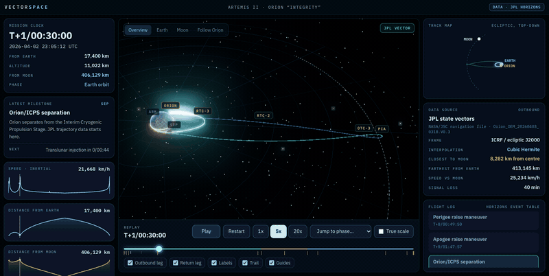
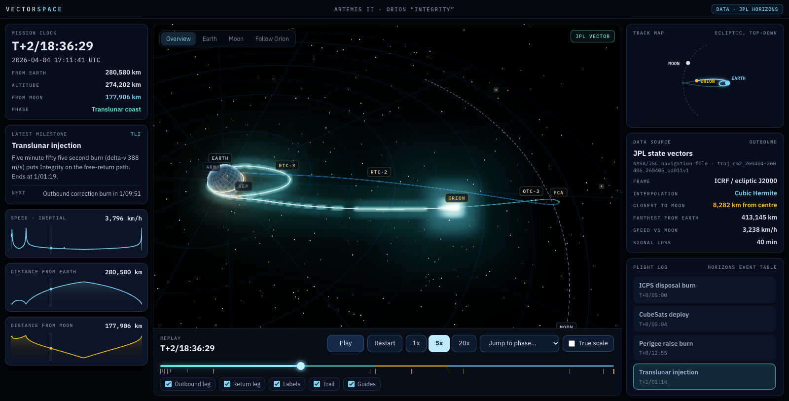
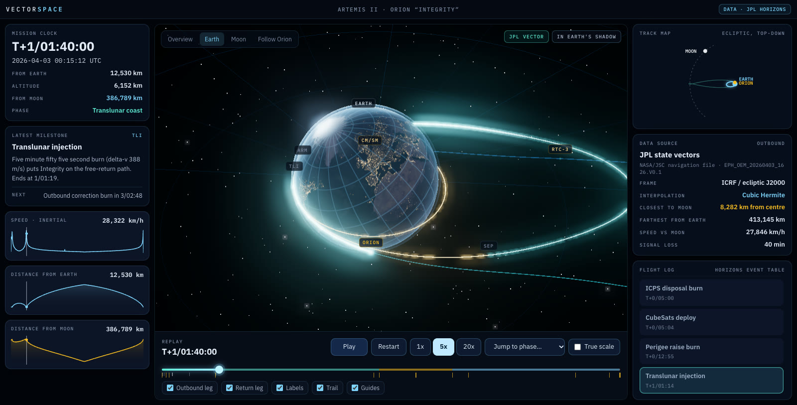
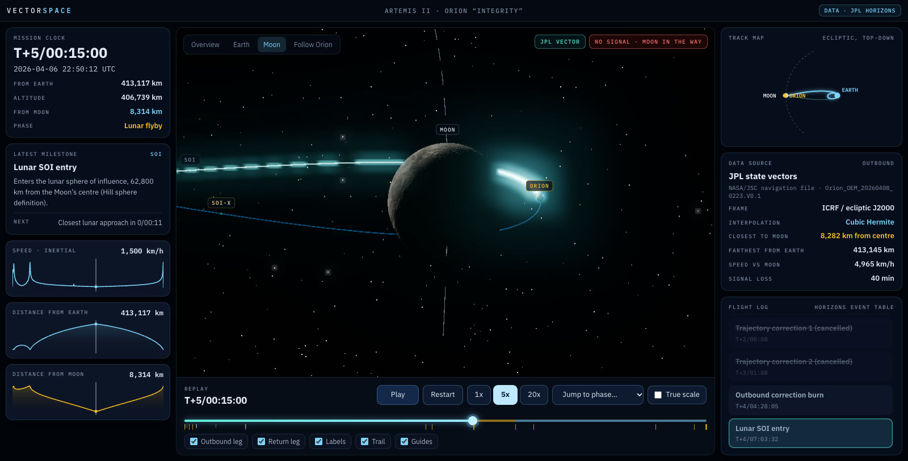
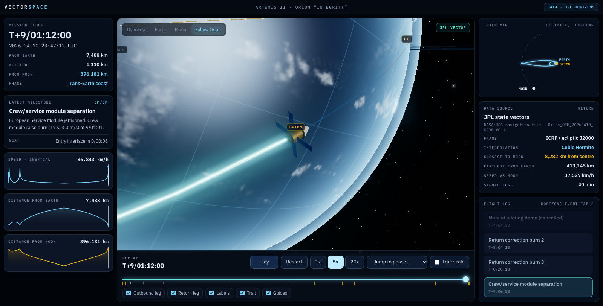
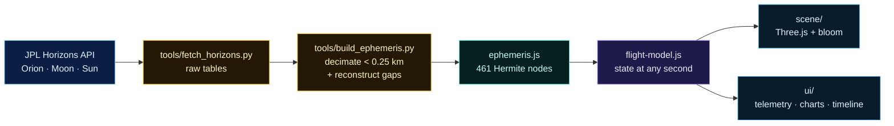

<p align="center">
  
</p>

<p align="center">
  
  
  
  
  
</p>

<p align="center">
  <b>Every position you see is a real state vector.</b><br/>
  Vector Space replays crewed spaceflights in an interactive 3D mission-control view,<br/>
  driven by the navigation data NASA publishes through JPL Horizons.
</p>

<p align="center">
  
</p>

---

## Flight 01 · Artemis II

April 1–11, 2026. Orion *Integrity* carries Reid Wiseman, Victor Glover, Christina Koch and Jeremy Hansen
around the far side of the Moon on a free-return trajectory and brings them home to the Pacific.
Vector Space replays all 9 days, 1 hour and 32 minutes of it:

- **12,835 JPL state vectors** at one-minute resolution, from ICPS separation until 3.5 minutes before entry interface
- **Real lighting and rotation.** The Sun direction comes from the ephemeris, and Earth spins with sidereal time, so the ground under Orion and the day/night line are where they actually were
- **Derived events computed from the vectors**, not copied from a press kit: Earth-shadow pass, loss of signal behind the Moon, closest approach
- **Honest data provenance.** A live chip shows whether the current point is a JPL vector or a reconstructed segment, down to the NASA/JSC navigation file it came from

<table>
  <tr>
    <td width="50%"><br/><sub><b>Overview.</b> The whole figure-eight, T+2/18:36:29.</sub></td>
    <td width="50%"><br/><sub><b>Earth.</b> Leaving Earth after TLI, inside Earth's shadow.</sub></td>
  </tr>
  <tr>
    <td width="50%"><br/><sub><b>Lunar flyby.</b> Behind the Moon, with no line of sight to Earth.</sub></td>
    <td width="50%"><br/><sub><b>Chase cam.</b> Six minutes before entry interface over the Pacific.</sub></td>
  </tr>
</table>

## Checked against NASA

All of these numbers are computed from the vectors at runtime and enforced by the test suite.

| Quantity | Computed from vectors | Published figure |
|---|---|---|
| Closest approach to the Moon | **8,282.0 km** from centre, T+5/00:25:18 | 8,282 km, 5/00:26 (Horizons) |
| Farthest from Earth's centre | **413,144.9 km**, T+5/00:29:18 | 413,146.2 km, 5/00:30 (Horizons) |
| Peak altitude | **406,767 km** | 406,771 km / 252,756 mi (NASA) |
| Earth shadow | **1/01:35:18 – 1/02:42:38** | 1/01:35 – 1/02:41 (Horizons) |
| Loss of signal behind the Moon | **40 min** | about 40 min (NASA) |
| Entry interface (122 km) | **T+9/01:18:17** at 11.0 km/s | 9/01:18 (Horizons) |
| Splashdown speed, Earth-relative | **31 km/h** | 27 km/h (NASA) |

## Quick start

No dependencies, no bundler. Any static server works; the bundled one disables caching:

```bash
npm start                # or: python3 tools/serve.py 8000
```

Open <http://localhost:8000>. The 3D view loads Three.js from jsDelivr; the panels and timeline keep working without it.

```bash
npm test                 # flight-model tests (node:test, Node 20+)
npm run data:fetch       # re-download the raw tables from JPL Horizons
npm run data:build       # rebuild src/mission/artemis-ii/ephemeris.js from them
```

## Controls

| Input | Action |
|---|---|
| <kbd>Space</kbd> | Play / pause |
| <kbd>←</kbd> <kbd>→</kbd> | Step one hour (<kbd>Shift</kbd>: ten minutes) |
| <kbd>Home</kbd> <kbd>End</kbd> | Launch / splashdown |
| Drag · scroll · right-drag | Orbit · zoom · pan |
| Gold tags, chart, flight log | Click to jump to that moment |
| `1x` `5x` `20x` | 1x = 30 min of flight per second; ascent and entry slow to 1 min/s |

Any moment can be linked directly:

```
http://localhost:8000/#t=5/00:15&view=moon&play=0
```

`t` takes `d/hh:mm[:ss]` or seconds, `view` is `overview`, `earth`, `moon` or `spacecraft`, `speed` is `1`, `5` or `20`.

## How it works



1. **Fetch.** Geocentric ecliptic J2000 vectors (km, km/s, UT) for Orion (`-1024`, 1 min), the Moon (`301`, 10 min) and the Sun (`10`, 1 h).
2. **Compress.** Samples are dropped while cubic Hermite interpolation (position + velocity) still reproduces every original vector within 0.25 km: 12,835 vectors become 242 nodes.
3. **Fill the gaps.** Horizons has no vectors before ICPS separation or after 23:51 UTC on April 10. Those spans are rebuilt from orbital mechanics (see below) and flagged.
4. **Replay.** The flight model answers "where, how fast, what's visible" for any second; the scene and the panels render it.

### What is measured and what is reconstructed

| Span | Source |
|---|---|
| Launch → apogee raise (T+0 … 1:47:57) | Reconstructed: ascent blend from LC-39B into the 185 × 2,223 km checkout orbit NASA published |
| Apogee raise burn (~15 min) | Reconstructed: smooth blend between the two orbits |
| Apogee raise → ICPS separation | First JPL vector propagated backwards (gravity + J2) |
| **ICPS separation → 23:51 UTC, April 10** | **JPL Horizons vectors (NASA/JSC navigation files)** |
| 23:51 UTC → entry interface | Last JPL vector propagated forwards (gravity + J2) |
| Entry interface → splashdown | Modelled descent along a great circle to the recovery point, 32.3°N 117.8°W |

Reconstructed spans are drawn in amber in the 3D view.

### Display scale

Earth and the Moon are drawn three times larger than life so they read on screen. To keep the path outside the
enlarged globe, positions near Earth are lifted radially by a smooth, monotonic offset that fades to zero
60,000 km above the surface. Every number in the panels uses the true, unlifted positions. **True scale** turns
the enlargement off.

## Project layout

```
index.html              page shell and import map
styles/main.css         design tokens and layout
src/
  main.js               wiring: model, player, UI, lazy-loaded scene
  player.js             playback clock
  core/                 astronomy helpers, Hermite interpolation, time formatting
  mission/
    flight-model.js     time queries over any mission definition
    artemis-ii/         events, phases, navigation files, generated ephemeris
  scene/                Three.js: Earth, Moon, spacecraft, trajectory, labels, camera rig
  ui/                   telemetry, sparklines, minimap, timeline, flight log, controls
tools/                  fetch, build and serve scripts (Python stdlib only)
data/horizons/          raw Horizons responses, kept for reproducibility
tests/                  node:test suite for the flight model
```

## Next flights

The flight model is mission-agnostic, so the next replays need data, not a rewrite. Candidates already available in Horizons:

- **Apophis, 13 April 2029.** A 340 m asteroid passing 38,000 km from Earth's centre, inside the geostationary belt
- **JWST** on its way to Sun–Earth L2
- **DART** impacting Dimorphos, plus **Parker Solar Probe**, **Voyager 1** and **New Horizons** (these need a heliocentric view)

## Credits

- **Trajectory and events:** [NASA/JPL Horizons](https://ssd.jpl.nasa.gov/horizons/), target `-1024`, built from NASA/JSC navigation files. US government data, public domain.
- **Mission facts:** [NASA Artemis II](https://www.nasa.gov/mission/artemis-ii/). Splashdown site from [Wikipedia](https://en.wikipedia.org/wiki/Artemis_II).
- **Earth and Moon textures:** from the [three.js examples](https://github.com/mrdoob/three.js/tree/dev/examples/textures/planets). They are based on NASA imagery, but upstream does not document their exact origin.
- **Rendering:** [three.js](https://threejs.org/) (MIT). **Type:** IBM Plex Sans and Mono (SIL OFL).
- **Origin of the idea:** the project started after a similar Artemis II visualizer appeared as a demo in OpenAI's [Introducing GPT-5.5](https://openai.com/index/introducing-gpt-5-5/) post. Vector Space is an independent implementation and contains no code or assets from that demo.

Vector Space is an independent project. It is not affiliated with or endorsed by NASA, JPL or OpenAI.

## License

[MIT](LICENSE)
